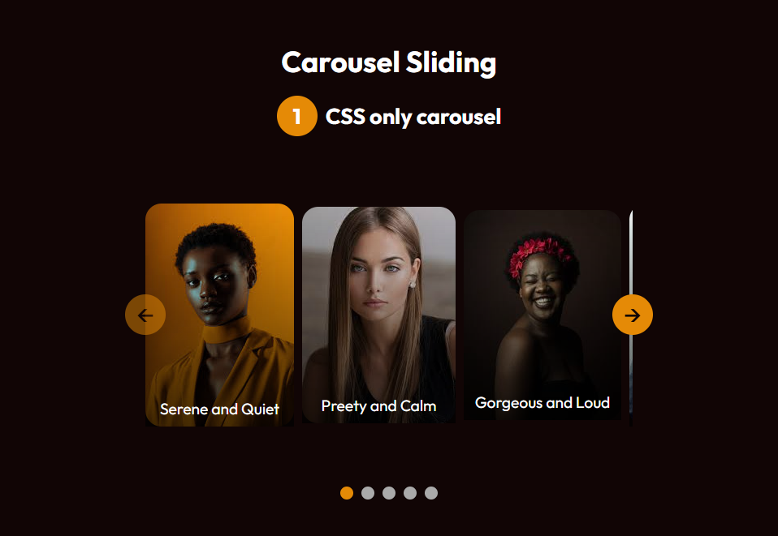

# Hey there!
This is my first carousel. I want to be able to track changes made and add new stuff to it as I go. Yep. That's it.

# Day One
## Thursday, Dec 4, 2025
Just created simple HTML, made this readme file and the scss stuff. I wanna try the CSS only method on **[CSS ONLY Carousel? Learn ::scroll-button() in 9 Minutes](https://www.youtube.com/watch?v=gmI5nvzv170)**. I also want to style this md file. and make it look good as possible.

Now, I've made the changes for the scroll markers, the <code>h2</code> counters and the figure captions.

Okay. That's it for today.